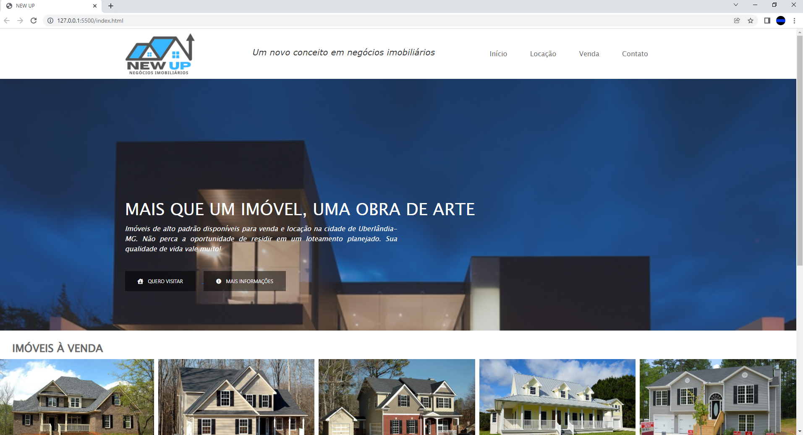
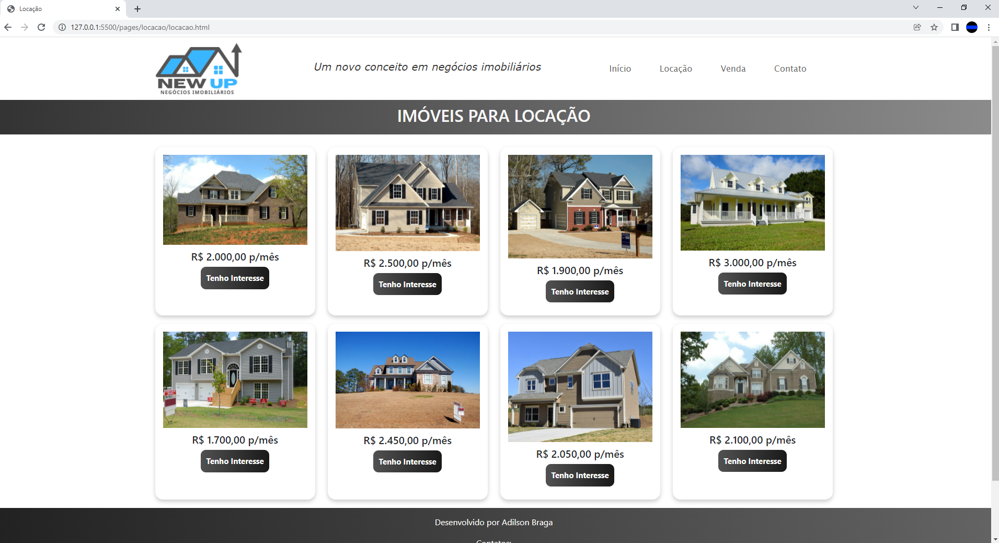
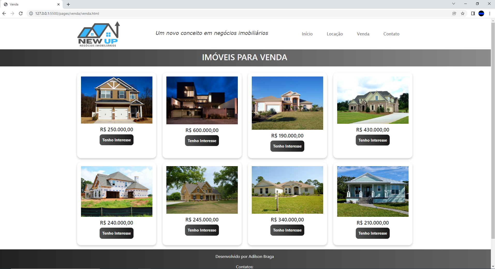
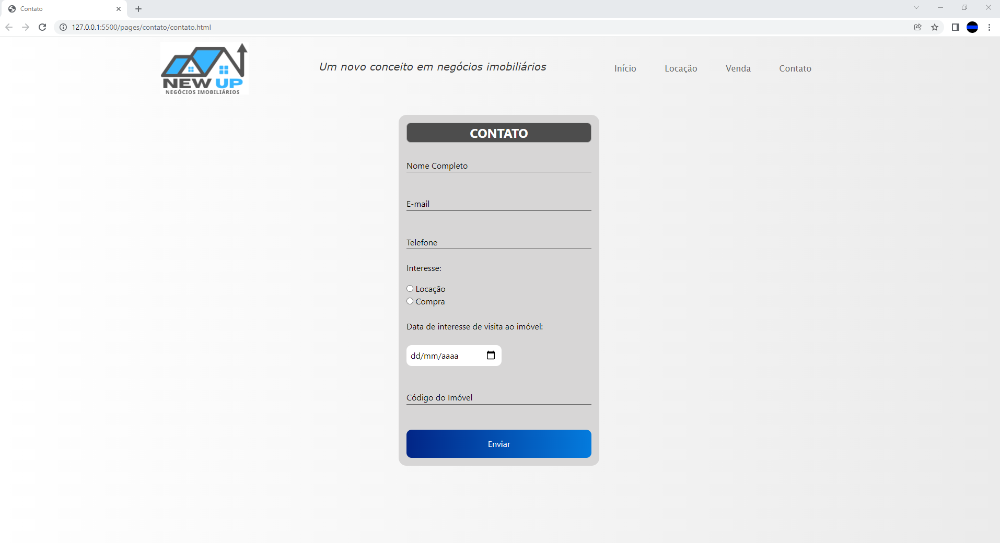

# PROJETO FRONTEND WEBSITE NEGÓCIOS IMOBILIÁRIOS

Projeto Frontend desenvolvido com a utilização das seguintes ferramentas:  
- HTML5
- CSS
- Bootstrap
- JQuery

O projeto foi desenvolvido com a utilização de apresentação em "carrossel" em sua página principal, bem como utilização do layout em container nas páginas de locação e venda, a fim de apresentar os imóveis em grade, no estilo card-box.

A logotipo "NewUp" desenvolvida não corresponde a qualquer empresa real, sendo projetada tão somente para fins acadêmicos.

Capturas de tela:

## Tela principal
 

## Tela Locação
 

## Tela Vendas
 

## Tela Contato
 

